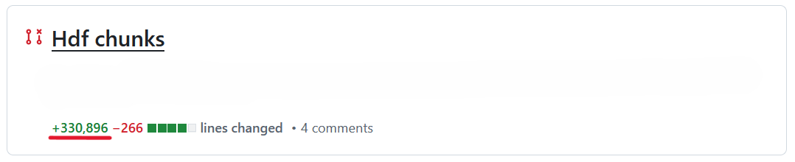

# Development Guideline

To maintain code quality, ensure consistency, and enable smooth collaboration across the team, it is essential to follow a standardized development workflow. This document outlines best practices for contributing to the project. By adhering to these guidelines, we can reduce bugs, improve readability, and speed up reviews and integration.

---

## 1. Branch Management

- All development code must be submitted to the `dev` branch.
- Do **not** push code directly to the `main` branch.
- All new features, bug fixes, and experiments should be done in the `dev` branch or a feature branch based on `dev`.
- Rather than creating duplicate code via copy-paste, modify the existing code directly in the `dev` branch. Do not worry about breaking things. Git will track all changes, and GitHub provides an easy-to-read visual comparison for reviewing edits.

---

## 2. Code Style and Documentation

- **Write modular, reusable functions** instead of duplicating code through copy-paste.
- Use **NumPy-style docstrings** for all functions and modules.
- Use **Python type hints** to improve clarity and robustness.
- Format your code using [`black`](https://github.com/psf/black) to enforce consistency.
- Run [`flake8`](https://flake8.pycqa.org/) to check for style issues and potential bugs.

---

## 3. Testing

- Each module in the source code should have a corresponding test file placed in the `tests/` directory.
- Use [`pytest`](https://docs.pytest.org/) to implement and run unit tests.
- Tests should cover core logic and include edge cases.
- Make sure your code **passes all tests** before pushing to GitHub.

---

## 4. Commit Best Practices

- Update your code regularly in small, manageable chunks.
- Avoid large, monolithic commits because they are harder to review and debug.
    - Example of an unreviewable PR (**avoid**)

- (Optional) Follow the [Conventional Commits](https://www.conventionalcommits.org/) style for consistency.

---

## 5. Pull Requests

- Open a **Pull Request (PR)** when contributing to the `main` branch.
- A reviewer will be notified, review your code, and provide feedback.
- Revise your code based on the feedback before merging into `main`.

---

## 6. Collaboration Tips

- Regularly pull the latest changes from the `dev` branch to avoid conflicts.
- Communicate before making major changes to ensure team alignment.
- Don’t hesitate to ask questions or reach out by opening an issue on GitHub.

---

## 7. System-Level Thinking

- Software developed in a project should be treated as part of a **coherent system**, not as a collection of independent components.
- Existing code establishes **implicit contracts**, including:
    - Interfaces (inputs/outputs)
    - Data semantics
    - Structural assumptions
    - Downstream dependencies
- When adding new functionality, contributors are expected to:
    - **Align with existing abstractions and structure** rather than introducing parallel or ad hoc designs.
    - **Prioritize integrating new components seamlessly with existing ones**; changes elsewhere should be considered only when necessary.
    - Distinguish clearly between:
        - Decisions that can be made locally (implementation details), and
        - Decisions that affect the system as a whole (interfaces, structure, semantics).
    - Implementing a feature in isolation, without considering how it fits into the surrounding system, is considered **incomplete development**.
    - If the intended integration or alignment is unclear, contributors should **seek clarification before implementing changes**. Independent work means owning delivery within agreed boundaries: contributors may decide implementation details, but **must communicate early** when changes affect interfaces, definitions, outputs, thresholds, interpretation, or other people’s work. **Avoid silent behavioral changes**, especially those that alter semantics or downstream results. 
        - [Good example](https://github.com/xin-huang/sstar/issues/35) by [@andreabio](https://github.com/andreabio).
        - [Good example](https://github.com/xin-huang/selscape/issues/6) by [@nomis-c](https://github.com/nomis-c). 

## References

- Beck K, et al. (2001) [Manifesto for agile software development](https://agilemanifesto.org/).
- Brooks F. (1975) [*The Mythical Man-Month: Essays on Software Engineering*](https://web.eecs.umich.edu/~weimerw/2018-481/readings/mythical-man-month.pdf). Addison-Wesley.
- Browning B. (2016) [An introduction to genotype imputation](https://www.youtube.com/watch?v=-oUvXXg6tl8). Computational Genomics Summer Institute 2016 at the Institute for Pure and Applied Mathematics.
- Wilson G, et al. (2014) [Best practices for scientific computing](https://doi.org/10.1371/journal.pbio.1001745). *PLoS Biology* **12**: e1001745.
